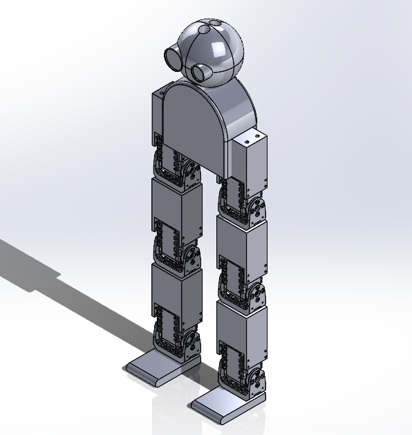

# Lil Runner CAD files and Initial 3D print look

This project was a university project done in the course IN5590

## 1) CAD files

 - Lil Runner fully assembled:

- [exploaded view feature in SolidWorks](https://help.solidworks.com/2022/english/SolidWorks/sldworks/c_Exploded_Views_in_Assemblies.htm) of Lil Runner:

## 2) 3D-print

A full assembly of all the 3D-printed parts:

A table of 3D-printer material used, infill and layer hight for all my parts:

|    Part    | Material        | Infill   | Layer hight |
| ---------- | --------------- | -------- |------------|
| legs | [PolyMaker PLA](https://docs.rs-online.com/b4bb/A700000006921793.pdf) | 20 % | .16 mm  
| body/head | [PolyMaker PLA](https://docs.rs-online.com/b4bb/A700000006921793.pdf) | 5 % | .20mm          

## 3) Bill of materials

| Item | Description      | Quantity 
| ---- | ---------------- | -------- 
| 1    | [Dynamixel AX12](https://emanual.robotis.com/docs/en/dxl/ax/ax-12a/) | 6       
